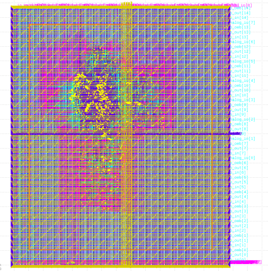

# Caravel User Project

  

# Azadi RISC-V SoC
Azadi is an SoC with 32-bit RISC-V signal core extented version of [ibex](https://github.com/lowRISC/ibex) we named it as "buraq", it is a 3-stage pipeline core which implements the RV32IMF instruction set architecture, limited number of peripherals UART, SPI, GPIO, PWM and timer.
The parent repository of azadi-soc can be found [here](https://github.com/merledu/azadi).

# Azadi SoC DFFRAM: Flattened with user_project_wrapper

